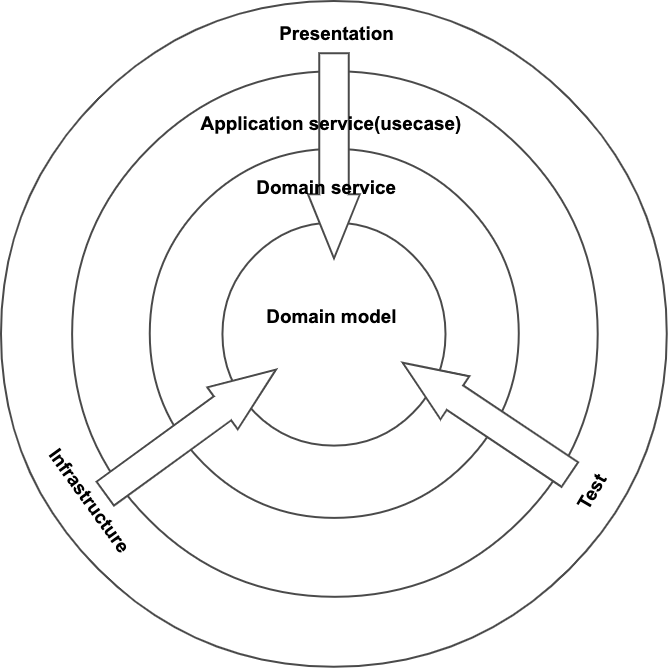
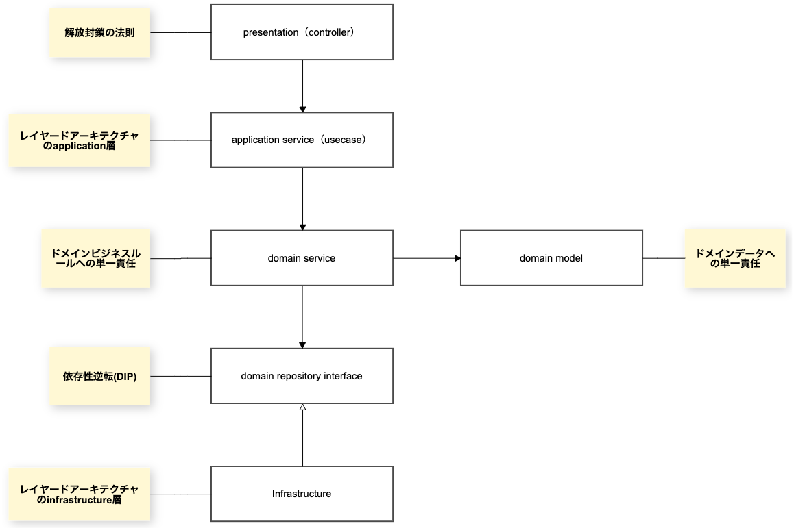

- 矢印は依存の方向を表す
- 矢印の逆方向に依存することはできない
- レイヤー間を飛び越えて依存することは可能
#

### presenter(controller)
- Layered ArchitectureにおけるUI(Presentation)層
- 外部から入力を受け取り、返却することが責務

### application service(usecase)
- Layered Architectureにおけるapplication層
- アプリケーション固有のロジック(ユースケースなど)を表す
- ドメイン層が公開するメソッドを組み合わせ、ユースケースを組み立てるのが責務

### domain service
- Layered Architectureにおけるdomain層
- ビジネスロジックを表す
- ビジネスルールに沿ったデータ整合性を担保するロジックを展開

### domain model
- Layered Architectureにおけるdomain層
- entityやvalue objectを表す

### domain registry interface
- DIコンテナ
- 依存の方向を内側に向けるためのinterfaceを表す

### infrastructure
- Layered Architectureにおけるinfrastructure層
- 永続化等のインフラを表す
- domain registryの実態
